# Architecture

How worker-health is put together, and why each seam is where it is.

Diagrams are Mermaid; GitHub, GitLab and most IDE previews render them
inline.

- [1. The problem, drawn](#1-the-problem-drawn)
- [2. Component map](#2-component-map)
- [3. Module layout](#3-module-layout)
- [4. The evidence ladder](#4-the-evidence-ladder)
- [5. Threading model](#5-threading-model)
- [6. One evaluation, end to end](#6-one-evaluation-end-to-end)
- [7. Per-check state machine](#7-per-check-state-machine)
- [8. Backoff while failing](#8-backoff-while-failing)
- [9. Readiness and liveness](#9-readiness-and-liveness)
- [10. Probe factory and configuration](#10-probe-factory-and-configuration)
- [11. Auto-instrumentation](#11-auto-instrumentation)
- [12. Django wiring](#12-django-wiring)
- [13. FastAPI wiring](#13-fastapi-wiring)
- [14. Telemetry pipeline](#14-telemetry-pipeline)
- [15. Deployment topology](#15-deployment-topology)
- [16. Design decisions and their costs](#16-design-decisions-and-their-costs)

---

## 1. The problem, drawn

A PM2-managed worker has one externally visible signal: the process is
running. That signal is true in every one of the states below, and only one
of them is healthy.

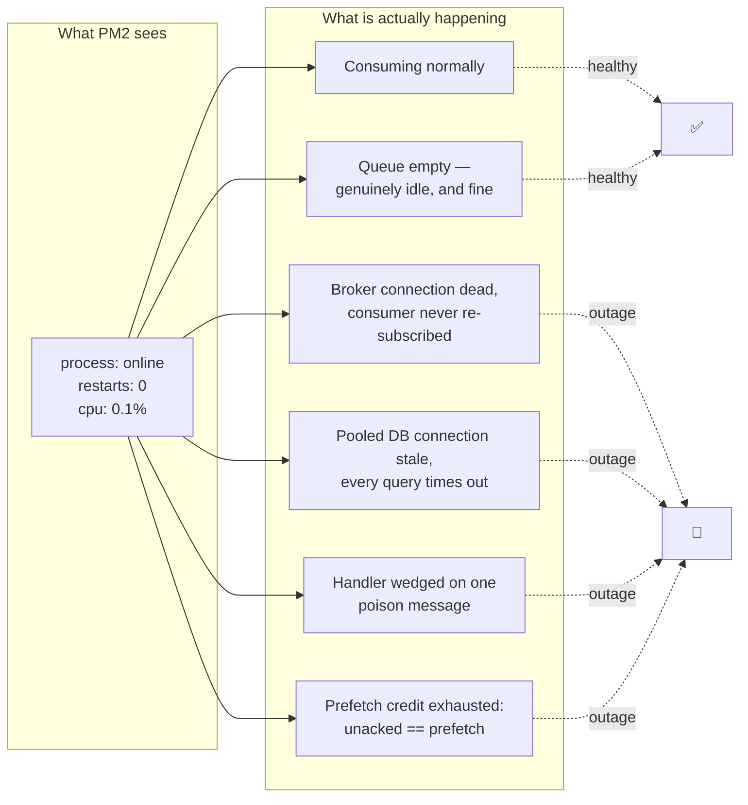

Two of those six states are fine and four are outages. Telling `E` from `B`
is the hard part, and it is why the SDK takes queue depth as an input
rather than inferring health from timers alone: **idle with an empty queue
is healthy forever; idle with a backlog is a stuck consumer.**

---

## 2. Component map

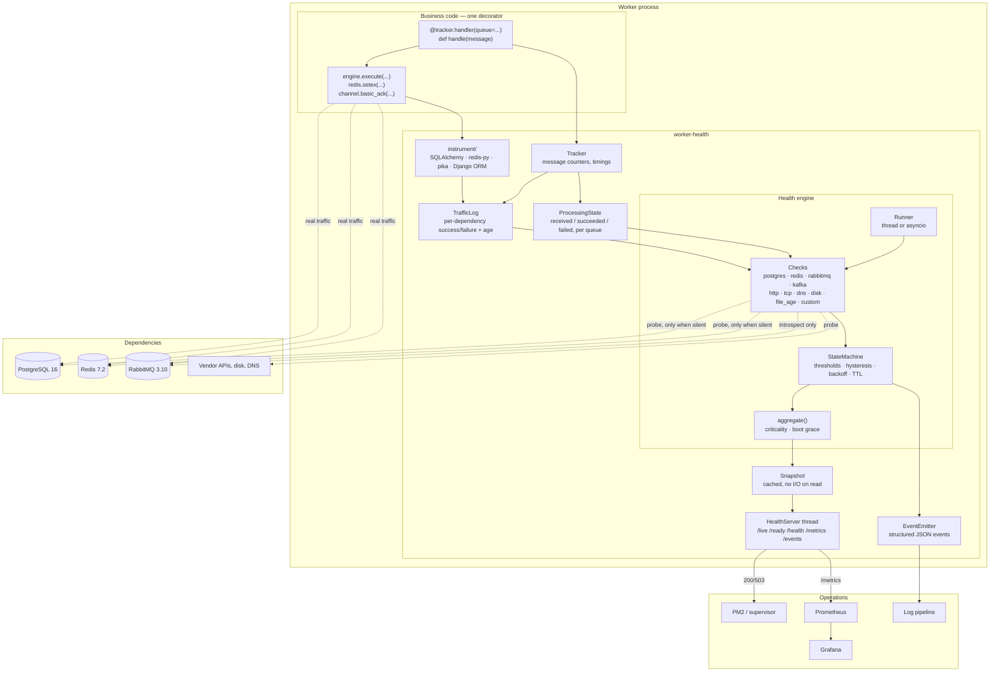

The arrow that matters most is the dotted one from business code to the
dependencies: **the worker's own traffic is the primary health signal.**
Probes are the fallback for silence, and they are labelled as such in every
result.

---

## 3. Module layout

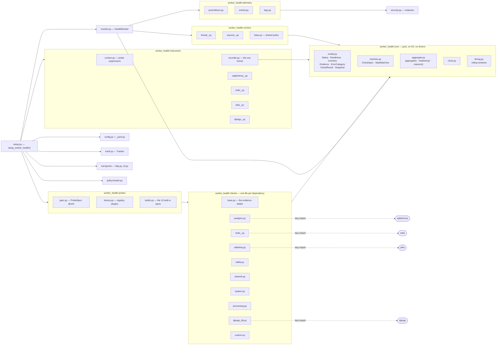

Every driver import is lazy and lives in the adapter that needs it. The
package itself has **no required dependencies**: a worker that uses Redis
but not SQLAlchemy never imports SQLAlchemy, and a config file loads
without PyYAML through the built-in subset parser.

---

## 4. The evidence ladder

The single most important decision in the codebase. Every check answers in
this order, and every result says which rung it came from.

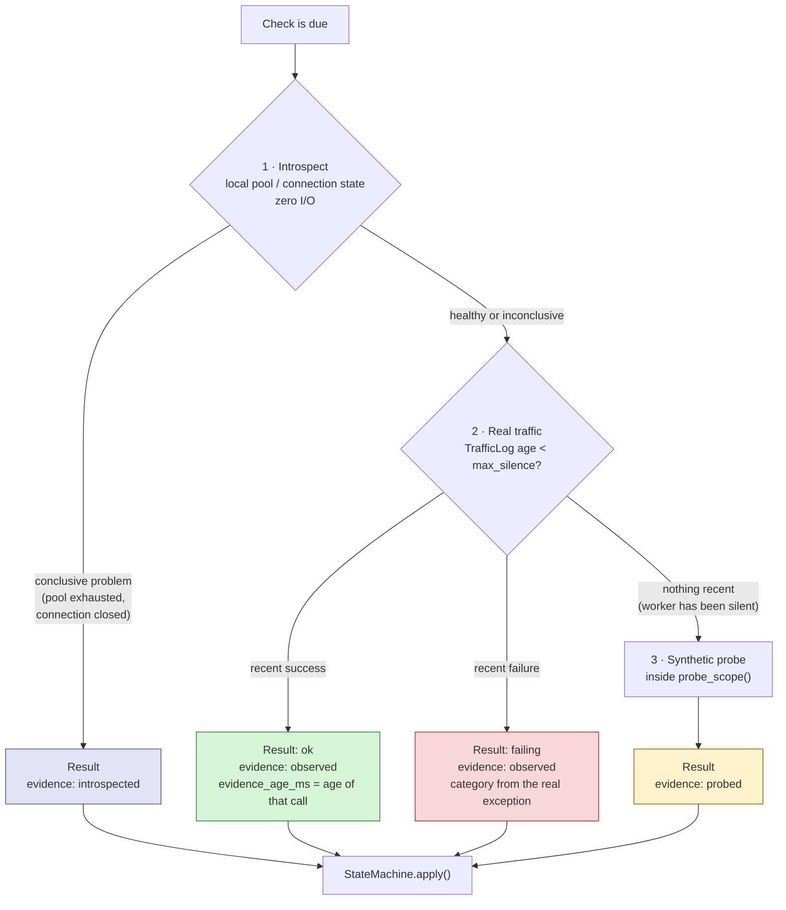

Why this order:

| Rung | Answers | Cost | Blind spot |
|---|---|---|---|
| `introspected` | "Can the app get a connection at all?" | zero | says nothing about the server |
| `observed` | "Is the worker's own connection working?" | zero | needs recent traffic |
| `probed` | "Can this process reach the dependency now?" | a round trip | can succeed on a *fresh* connection while the worker sits on a dead pooled one |

A probe-first design reports green while a worker holds a dead pooled
connection. That is the exact false positive this ordering removes.

`probe_scope()` on rung 3 is not decoration: it sets a `ContextVar` that
the instrumentation checks, so the probe's own `SELECT 1` is **not** written
to the traffic log. Without it, the monitor would observe its own probes,
conclude there had been recent traffic, and report `observed` on a worker
that had processed nothing all day.

---

## 5. Threading model

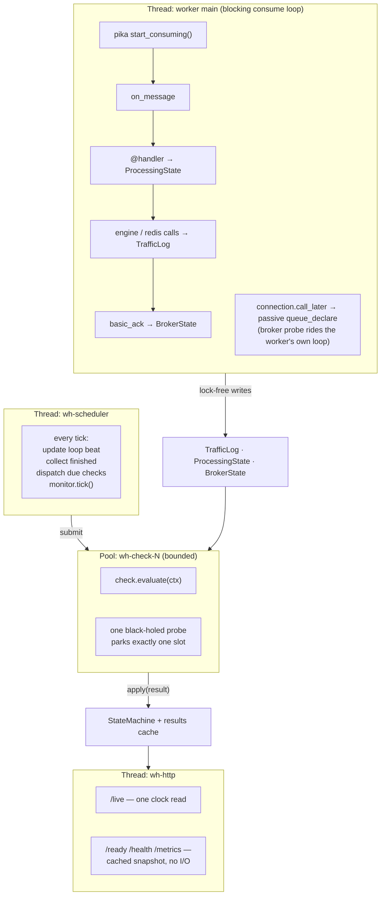

Three properties fall out of this shape:

1. **The HTTP endpoints survive a wedged worker.** They are on their own
   thread and serve a cached snapshot, so `/live` still answers when the
   consume loop is stuck — which is the only moment its answer matters.
2. **A hung probe cannot stall the others.** It occupies one pool slot; the
   scheduler records the timeout, reports the check failing, and moves on.
   A blocking driver call cannot be cancelled from outside, so the thread
   stays parked — but nothing waits with it.
3. **The broker probe rides the worker's own connection thread**
   (`call_later`), so if that loop stops turning, the broker state goes
   stale and the check reports it. A dedicated monitor connection would have
   kept reporting a cheerful green.

---

## 6. One evaluation, end to end

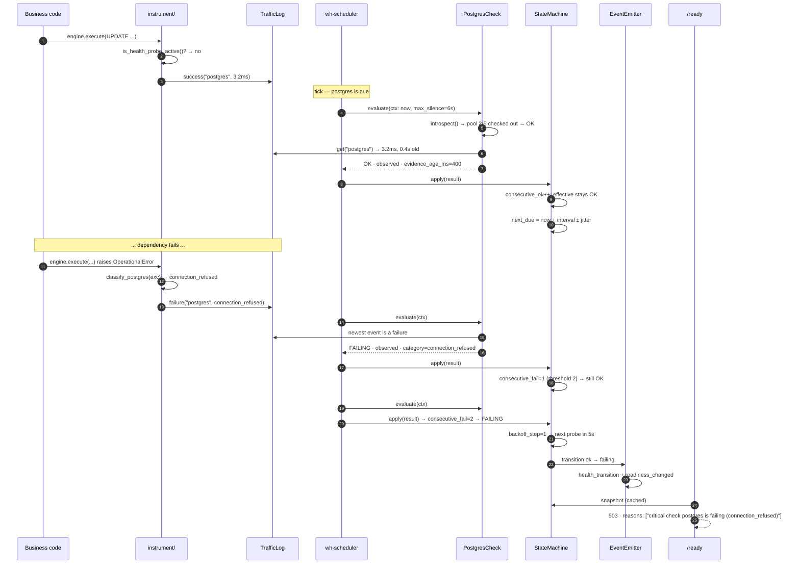

Note what never happens on the `/ready` path: no I/O, no probe, no driver
call. A health endpoint that probes inline is slow exactly when everything
else is already on fire.

---

## 7. Per-check state machine

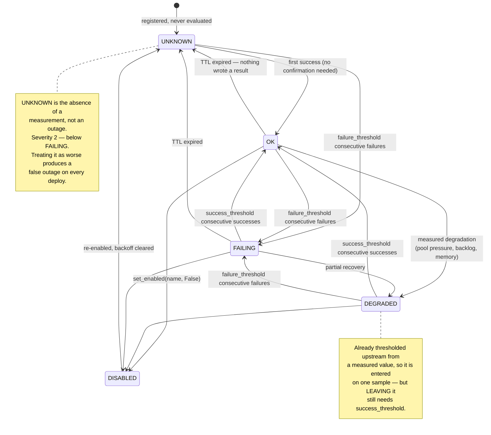

Three asymmetries, each deliberate:

- **Failure needs confirmation, first success does not.** One lost packet is
  not an outage; requiring confirmation of the *first* measurement would
  double every worker's time to ready with nothing to confirm against.
- **Recovery out of a bad state needs confirmation.** Otherwise a flapping
  dependency produces a flapping readiness signal, and the fleet oscillates
  in and out of rotation.
- **TTL is applied at read time, not write time.** This is what makes a
  wedged scheduler visible: nothing is writing results, so every check ages
  into `UNKNOWN` on its own rather than reporting a stale green forever.

---

## 8. Backoff while failing

A failing dependency is asked less often — the guardrail against turning
one outage into a retry storm against a service already in trouble.

```mermaid
gantt
    title Probe schedule after a failure (interval 10s, thresholds 2/2)
    dateFormat X
    axisFormat %Ss

    section Healthy
    every 10s ±20% jitter      :done, h1, 0, 10s
    every 10s                  :done, h2, 10, 10s

    section Confirming
    failure 1 (still OK)       :active, f1, 20, 10s
    failure 2 → FAILING        :crit, f2, 30, 5s

    section Backing off
    retry after 5s             :crit, b1, 35, 10s
    retry after 10s            :crit, b2, 45, 20s
    retry after 20s            :crit, b3, 65, 40s
    retry after 40s            :crit, b4, 105, 60s
    retry after 60s (capped)   :crit, b5, 165, 60s
```

`5 → 10 → 20 → 40 → 60 → 60…`, with 10% jitter so a fleet started by one
command does not re-probe in lockstep. One success resets the ladder
immediately; `success_threshold` still governs when the *status* flips back.

Reported status never changes because of backoff. A breaker that reported
`unknown` while open would hide the outage it exists to survive.

---

## 9. Readiness and liveness

Two questions, two answers, two endpoints — and a dependency failure may
never affect the first one.

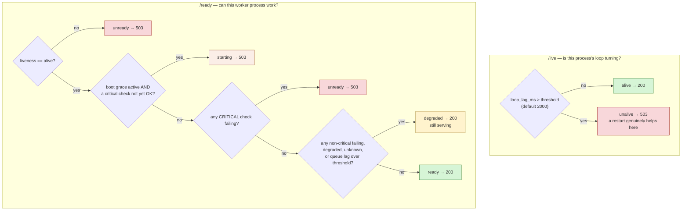

The two rules that keep this from causing outages of its own:

- **`/live` never consults a dependency.** If it did, a shared database
  going down would make every worker in the fleet look dead, and the
  supervisor would restart all of them into a database that is already
  struggling.
- **`degraded` returns 200.** A failing *non-critical* cache must not pull a
  worker out of rotation; that is how a cache outage becomes a total outage.

Whenever readiness answers anything but `ready`, the response carries a
`reasons` array naming the check and its error category — closed vocabulary
only, never driver text.

---

## 10. Probe factory and configuration

Configuration names things; the context supplies them; `@name` is where the
two meet.

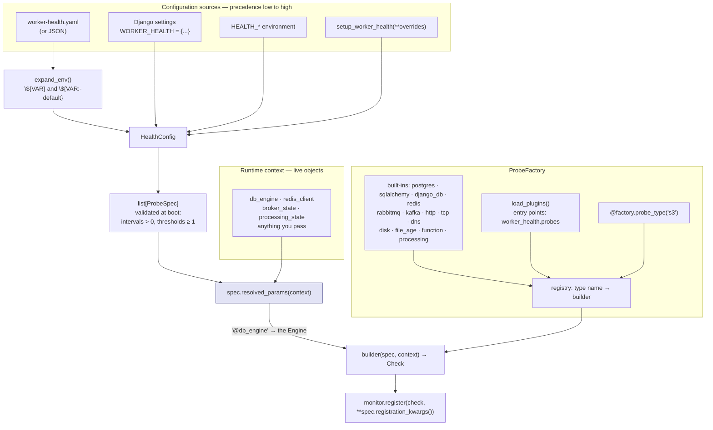

A builder is a plain function of `(spec, context)`. The built-ins use
exactly the same contract as a third-party plugin — nothing in the SDK has
privileges a user's own probe does not.

Failure handling is a deliberate fork: `strict_probes: true` (the default)
stops the worker at boot on a malformed probe, where a human is watching.
Set it false for a fleet rollout, and a bad config line becomes one
permanently-failing named check instead of a hundred workers refusing to
start.

---

## 11. Auto-instrumentation

The reason business code needs only a decorator.

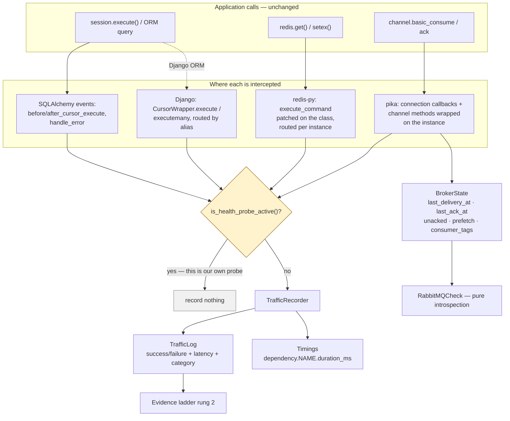

Two details worth knowing before you rely on it:

- **redis-py is patched on the class** (there is no other funnel), but the
  target is read off the *instance*. Two clients can report as
  `redis-cache` and `redis-locks`, and an unregistered client is passed
  straight through.
- **pika is wrapped on the channel instance**, so the probe channel on the
  same connection is unaffected — it keeps issuing passive declares without
  being counted as consumption.

Instrumentation is best-effort by design. If a driver version moves the
method being patched, the worker still boots, still probes, and still
reports — with `probed` evidence instead of `observed`. The evidence label
is what tells you which happened.

---

## 12. Django wiring

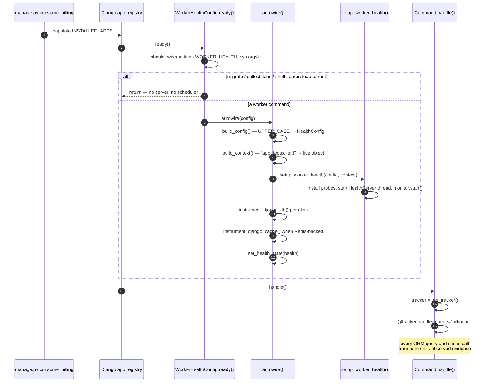

`should_wire` is the part that is easy to get wrong and expensive when you
do. `ready()` fires for *every* Django entry point — `migrate`,
`collectstatic`, `shell`, pytest, and the autoreloader's parent process.
Starting an HTTP server in all of them means port collisions in CI and a
health monitor attached to a migration container. The default skip-list
covers Django's own commands; `COMMANDS: [...]` is the precise answer once
you have more than one worker.

---

## 13. FastAPI wiring

```mermaid
sequenceDiagram
    autonumber
    participant U as uvicorn
    participant LS as health_lifespan()
    participant SDK as setup_worker_health()
    participant C as BillingConsumer
    participant Loop as event loop

    U->>LS: startup
    LS->>LS: context() — engine, redis, broker_state
    LS->>SDK: build monitor (runner="asyncio")
    SDK->>SDK: instrument async SQLAlchemy + redis.asyncio
    SDK->>SDK: install probes whose @refs are present
    SDK->>SDK: HealthServer thread + monitor.start()
    LS->>LS: app.state.monitor / .tracker / .health
    LS->>C: BillingConsumer(tracker)
    LS->>Loop: create_task(consumer.run())
    Note over Loop: the asyncio runner's loop-lag probe now measures<br/>the thing that actually breaks async workers:<br/>a coroutine blocking the loop

    U->>LS: shutdown
    LS->>Loop: task.cancel() for each consumer
    LS->>Loop: await each task
    Note over LS: awaiting the cancelled task is what turns<br/>"Task exception was never retrieved"<br/>into a clean shutdown
    LS->>SDK: health.stop()
```

The optional `/internal/*` routes serve the same data from the event loop.
They are a convenience for platforms that route only one port — and they
stop answering when the loop wedges, which is precisely when the SDK's own
threaded port keeps working. Use the threaded port for liveness wherever
you can.

---

## 14. Telemetry pipeline

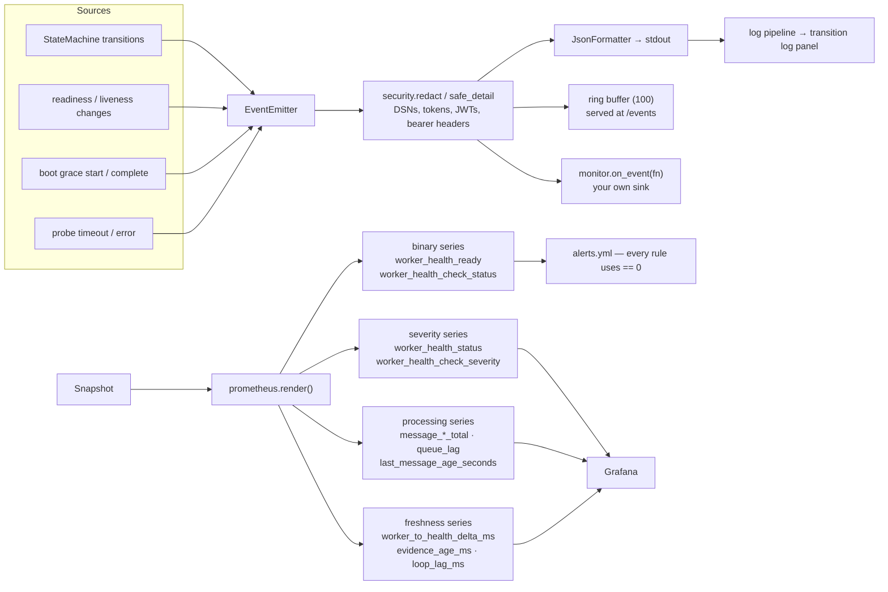

Two families per verdict is on purpose. Alerts read the binary series
because `== 0` cannot be misread and survives someone adding a status value
later; dashboards read the severity series because they want to colour
`degraded` differently from `failing`. One series doing both jobs is how an
alert ends up saying `< 2` and nobody remembers why.

Label cardinality is bounded by construction: `service`, `instance`,
`check`, `queue`, `critical`, `evidence`, `category`, `state`, `quantile` —
every one of them drawn from a registered name or a closed enum. No error
string ever becomes a label.

---

## 15. Deployment topology

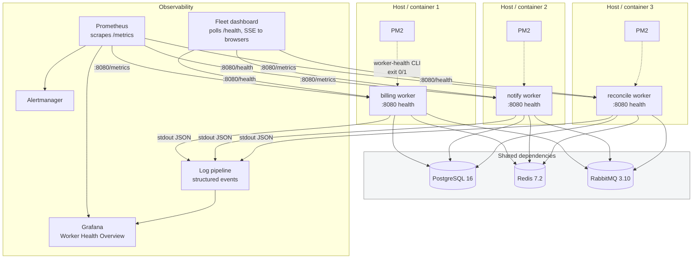

The health port carries **no authentication**. Bind it to loopback or a
private interface and let the scraper reach it there; never publish it. See
[OPERATIONS.md](OPERATIONS.md#security).

---

## 16. Design decisions and their costs

Every one of these is a trade, and the cost side is real.

| Decision | Bought | Cost |
|---|---|---|
| Traffic-first evidence | Detects a dead pooled connection a fresh probe would miss; near-zero probe load under traffic | Needs instrumentation to be wired; a silent worker falls back to probing, and the evidence label is the only way to tell |
| Probes suppressed from the traffic log | A silent worker can never look busy on the strength of its own health checks | One more moving part (a `ContextVar`) that a custom check bypassing `BaseCheck.probe` would not get |
| RabbitMQ check is introspection-only | A wedged worker shows up as stale state; the check cannot itself break consumption | Requires `install_broker_probe` and an instrumented channel; a broker that is up but unreachable *only* from this worker looks the same as a dead connection — which is arguably correct |
| Restart policy excludes dependency faults | A database outage does not become forty crash-looping workers | A worker genuinely poisoned by a dependency interaction needs a human |
| TTL applied at read time | A wedged scheduler becomes visible instead of freezing a green result | Checks age into `unknown` during long GC pauses on very short TTLs |
| Cached snapshot, no I/O on `/ready` | Sub-millisecond responses under load and during an outage | The answer is up to one check interval old; `health_eval_age_ms` is published so you can see exactly how old |
| Zero required dependencies | Installs anywhere; no version conflict with the worker's own stack | A hand-written YAML subset parser to maintain (PyYAML is used when present) |
| Class-level patch for redis-py | The only funnel that catches every command | Process-global; per-instance routing and an idempotence flag are required to make it safe |
| Binary *and* severity metric families | Unambiguous alerts, expressive dashboards | Two series per verdict to document and keep consistent |

---

## Further reading

- [USAGE.md](USAGE.md) — step-by-step integration guides
- [CONFIGURATION.md](CONFIGURATION.md) — every setting and probe type
- [OBSERVABILITY.md](OBSERVABILITY.md) — metrics, events, dashboards, alerts
- [OPERATIONS.md](OPERATIONS.md) — failure matrix, recovery, security, PM2
